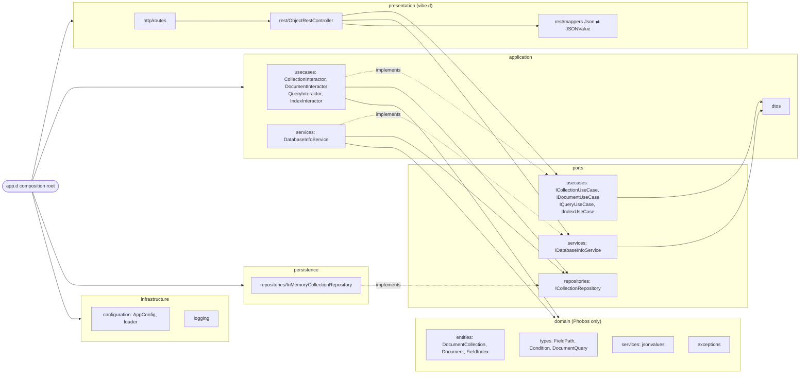
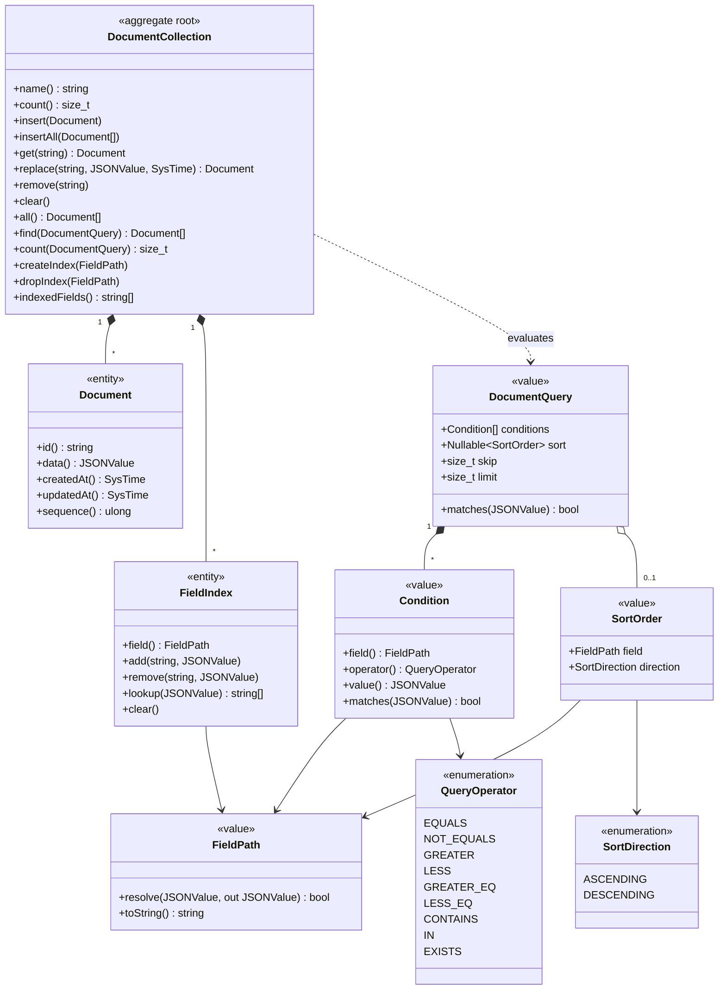
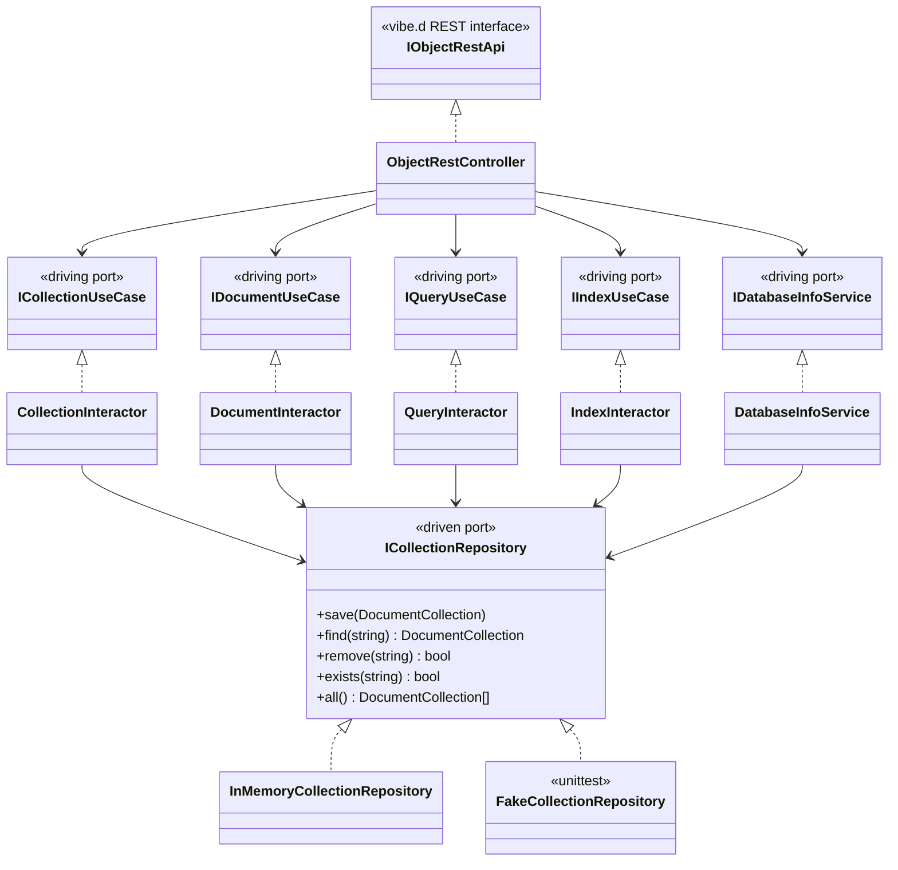
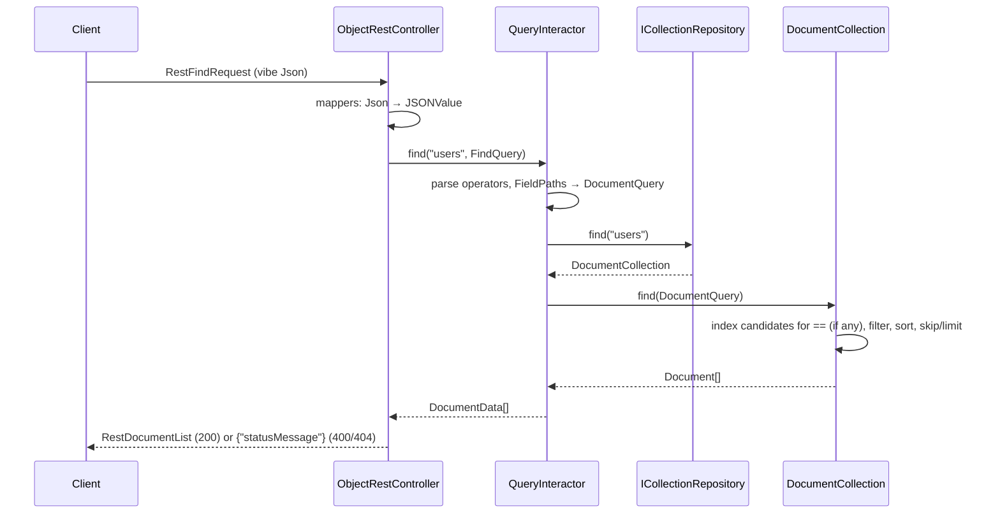

# object – UML

## Components and dependency direction

```mermaid
flowchart LR
  subgraph presentation["presentation (vibe.d)"]
    routes[http/routes]
    rest[rest/ObjectRestController]
    map[rest/mappers Json ⇄ JSONValue]
  end
  subgraph ports
    pu[usecases: ICollectionUseCase, IDocumentUseCase<br/>IQueryUseCase, IIndexUseCase]
    ps[services: IDatabaseInfoService]
    pr[repositories: ICollectionRepository]
  end
  subgraph application
    uc[usecases: CollectionInteractor, DocumentInteractor<br/>QueryInteractor, IndexInteractor]
    as[services: DatabaseInfoService]
    dto[dtos]
  end
  subgraph domain["domain (Phobos only)"]
    ent[entities: DocumentCollection, Document, FieldIndex]
    typ[types: FieldPath, Condition, DocumentQuery]
    dsv[services: jsonvalues]
    exc[exceptions]
  end
  subgraph persistence
    mem[repositories/InMemoryCollectionRepository]
  end
  subgraph infrastructure
    cfg[configuration: AppConfig, loader]
    log[logging]
  end
  app([app.d composition root])

  routes --> rest --> pu & ps
  rest --> map
  uc -. implements .-> pu
  as -. implements .-> ps
  uc & as --> pr
  mem -. implements .-> pr
  uc & as --> domain
  pu & ps --> dto
  app --> presentation & application & persistence & infrastructure
```

## Domain model

```mermaid
classDiagram
  class DocumentCollection {
    <<aggregate root>>
    +name() string
    +count() size_t
    +insert(Document)
    +insertAll(Document[])
    +get(string) Document
    +replace(string, JSONValue, SysTime) Document
    +remove(string)
    +clear()
    +all() Document[]
    +find(DocumentQuery) Document[]
    +count(DocumentQuery) size_t
    +createIndex(FieldPath)
    +dropIndex(FieldPath)
    +indexedFields() string[]
  }
  class Document {
    <<entity>>
    +id() string
    +data() JSONValue
    +createdAt() SysTime
    +updatedAt() SysTime
    +sequence() ulong
  }
  class FieldIndex {
    <<entity>>
    +field() FieldPath
    +add(string, JSONValue)
    +remove(string, JSONValue)
    +lookup(JSONValue) string[]
    +clear()
  }
  class DocumentQuery {
    <<value>>
    +Condition[] conditions
    +Nullable~SortOrder~ sort
    +size_t skip
    +size_t limit
    +matches(JSONValue) bool
  }
  class Condition {
    <<value>>
    +field() FieldPath
    +operator() QueryOperator
    +value() JSONValue
    +matches(JSONValue) bool
  }
  class SortOrder {
    <<value>>
    +FieldPath field
    +SortDirection direction
  }
  class FieldPath {
    <<value>>
    +resolve(JSONValue, out JSONValue) bool
    +toString() string
  }
  class QueryOperator {
    <<enumeration>>
    EQUALS
    NOT_EQUALS
    GREATER
    LESS
    GREATER_EQ
    LESS_EQ
    CONTAINS
    IN
    EXISTS
  }
  class SortDirection {
    <<enumeration>>
    ASCENDING
    DESCENDING
  }

  DocumentCollection "1" *-- "*" Document
  DocumentCollection "1" *-- "*" FieldIndex
  DocumentCollection ..> DocumentQuery : evaluates
  DocumentQuery "1" *-- "*" Condition
  DocumentQuery o-- "0..1" SortOrder
  Condition --> FieldPath
  Condition --> QueryOperator
  SortOrder --> FieldPath
  SortOrder --> SortDirection
  FieldIndex --> FieldPath
```

## Ports and adapters

```mermaid
classDiagram
  class ICollectionRepository {
    <<driven port>>
    +save(DocumentCollection)
    +find(string) DocumentCollection
    +remove(string) bool
    +exists(string) bool
    +all() DocumentCollection[]
  }
  class InMemoryCollectionRepository
  class FakeCollectionRepository { <<unittest>> }
  ICollectionRepository <|.. InMemoryCollectionRepository
  ICollectionRepository <|.. FakeCollectionRepository

  class ICollectionUseCase { <<driving port>> }
  class IDocumentUseCase { <<driving port>> }
  class IQueryUseCase { <<driving port>> }
  class IIndexUseCase { <<driving port>> }
  class IDatabaseInfoService { <<driving port>> }
  ICollectionUseCase <|.. CollectionInteractor
  IDocumentUseCase <|.. DocumentInteractor
  IQueryUseCase <|.. QueryInteractor
  IIndexUseCase <|.. IndexInteractor
  IDatabaseInfoService <|.. DatabaseInfoService
  CollectionInteractor --> ICollectionRepository
  DocumentInteractor --> ICollectionRepository
  QueryInteractor --> ICollectionRepository
  IndexInteractor --> ICollectionRepository
  DatabaseInfoService --> ICollectionRepository

  class IObjectRestApi { <<vibe.d REST interface>> }
  IObjectRestApi <|.. ObjectRestController
  ObjectRestController --> ICollectionUseCase
  ObjectRestController --> IDocumentUseCase
  ObjectRestController --> IQueryUseCase
  ObjectRestController --> IIndexUseCase
  ObjectRestController --> IDatabaseInfoService
```

## Request flow: `POST /collections/users/find`

```mermaid
sequenceDiagram
  participant C as Client
  participant R as ObjectRestController
  participant Q as QueryInteractor
  participant Repo as ICollectionRepository
  participant D as DocumentCollection
  C->>R: RestFindRequest (vibe Json)
  R->>R: mappers: Json → JSONValue
  R->>Q: find("users", FindQuery)
  Q->>Q: parse operators, FieldPaths → DocumentQuery
  Q->>Repo: find("users")
  Repo-->>Q: DocumentCollection
  Q->>D: find(DocumentQuery)
  D->>D: index candidates for == (if any), filter, sort, skip/limit
  D-->>Q: Document[]
  Q-->>R: DocumentData[]
  R-->>C: RestDocumentList (200) or {"statusMessage"} (400/404)
```
