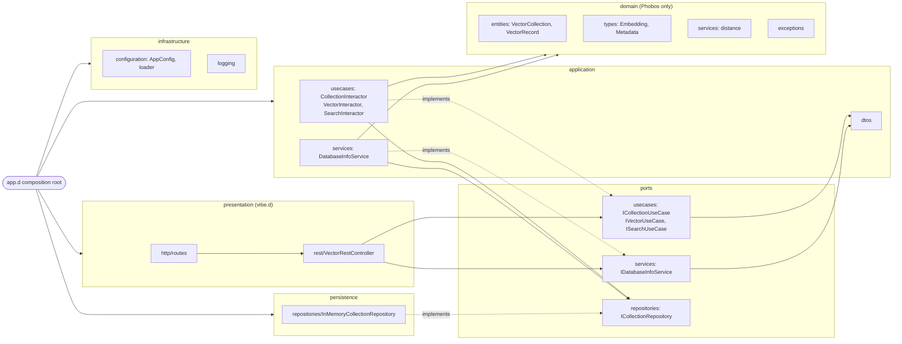
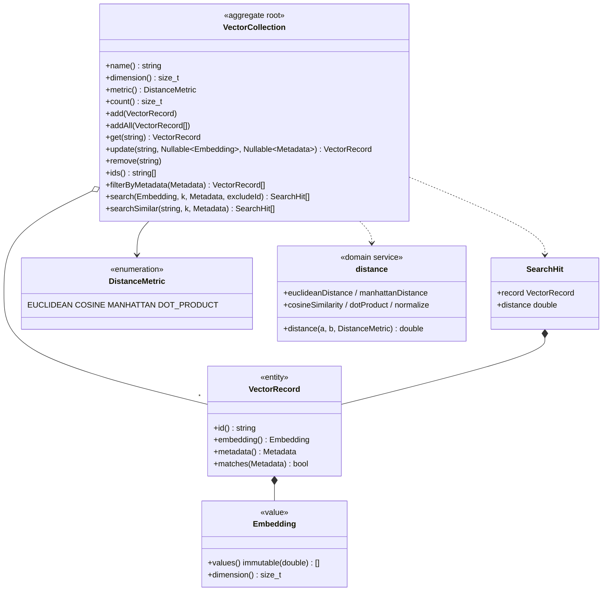
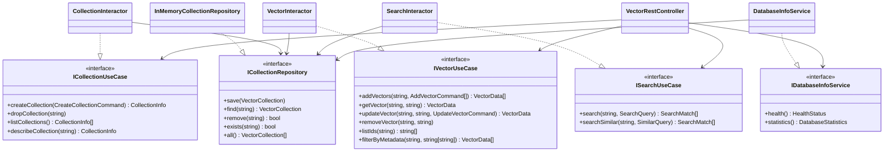
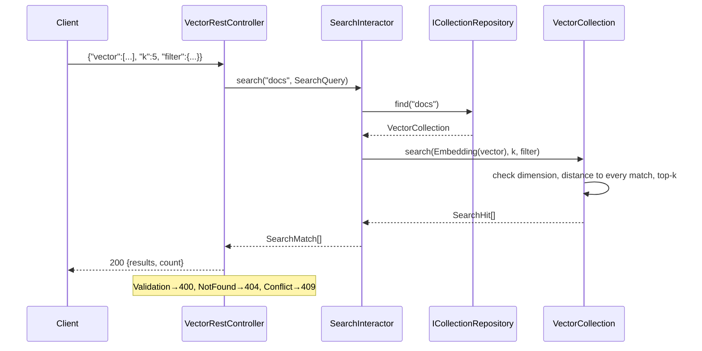

# vector – UML

## Components and dependency direction

```mermaid
flowchart LR
  subgraph presentation["presentation (vibe.d)"]
    routes[http/routes]
    rest[rest/VectorRestController]
  end
  subgraph ports
    pu[usecases: ICollectionUseCase<br/>IVectorUseCase, ISearchUseCase]
    ps[services: IDatabaseInfoService]
    pr[repositories: ICollectionRepository]
  end
  subgraph application
    uc[usecases: CollectionInteractor<br/>VectorInteractor, SearchInteractor]
    as[services: DatabaseInfoService]
    dto[dtos]
  end
  subgraph domain["domain (Phobos only)"]
    ent[entities: VectorCollection, VectorRecord]
    typ[types: Embedding, Metadata]
    dsv[services: distance]
    exc[exceptions]
  end
  subgraph persistence
    mem[repositories/InMemoryCollectionRepository]
  end
  subgraph infrastructure
    cfg[configuration: AppConfig, loader]
    log[logging]
  end
  app([app.d composition root])

  routes --> rest --> pu & ps
  uc -. implements .-> pu
  as -. implements .-> ps
  uc & as --> pr
  mem -. implements .-> pr
  uc & as --> domain
  pu & ps --> dto
  app --> presentation & application & persistence & infrastructure
```

## Domain model

```mermaid
classDiagram
  class VectorCollection {
    <<aggregate root>>
    +name() string
    +dimension() size_t
    +metric() DistanceMetric
    +count() size_t
    +add(VectorRecord)
    +addAll(VectorRecord[])
    +get(string) VectorRecord
    +update(string, Nullable~Embedding~, Nullable~Metadata~) VectorRecord
    +remove(string)
    +ids() string[]
    +filterByMetadata(Metadata) VectorRecord[]
    +search(Embedding, k, Metadata, excludeId) SearchHit[]
    +searchSimilar(string, k, Metadata) SearchHit[]
  }
  class VectorRecord {
    <<entity>>
    +id() string
    +embedding() Embedding
    +metadata() Metadata
    +matches(Metadata) bool
  }
  class Embedding {
    <<value>>
    +values() immutable(double)[]
    +dimension() size_t
  }
  class SearchHit {
    +record VectorRecord
    +distance double
  }
  class DistanceMetric {
    <<enumeration>>
    EUCLIDEAN COSINE MANHATTAN DOT_PRODUCT
  }
  class distance {
    <<domain service>>
    +distance(a, b, DistanceMetric) double
    +euclideanDistance / manhattanDistance
    +cosineSimilarity / dotProduct / normalize
  }

  VectorCollection o-- "*" VectorRecord
  VectorCollection --> DistanceMetric
  VectorCollection ..> distance
  VectorCollection ..> SearchHit
  VectorRecord *-- Embedding
  SearchHit *-- VectorRecord
```

## Ports and adapters

```mermaid
classDiagram
  class ICollectionUseCase {
    <<interface>>
    +createCollection(CreateCollectionCommand) CollectionInfo
    +dropCollection(string)
    +listCollections() CollectionInfo[]
    +describeCollection(string) CollectionInfo
  }
  class IVectorUseCase {
    <<interface>>
    +addVectors(string, AddVectorCommand[]) VectorData[]
    +getVector(string, string) VectorData
    +updateVector(string, string, UpdateVectorCommand) VectorData
    +removeVector(string, string)
    +listIds(string) string[]
    +filterByMetadata(string, string[string]) VectorData[]
  }
  class ISearchUseCase {
    <<interface>>
    +search(string, SearchQuery) SearchMatch[]
    +searchSimilar(string, SimilarQuery) SearchMatch[]
  }
  class IDatabaseInfoService {
    <<interface>>
    +health() HealthStatus
    +statistics() DatabaseStatistics
  }
  class ICollectionRepository {
    <<interface>>
    +save(VectorCollection)
    +find(string) VectorCollection
    +remove(string) bool
    +exists(string) bool
    +all() VectorCollection[]
  }

  CollectionInteractor ..|> ICollectionUseCase
  VectorInteractor ..|> IVectorUseCase
  SearchInteractor ..|> ISearchUseCase
  DatabaseInfoService ..|> IDatabaseInfoService
  InMemoryCollectionRepository ..|> ICollectionRepository
  CollectionInteractor --> ICollectionRepository
  VectorInteractor --> ICollectionRepository
  SearchInteractor --> ICollectionRepository
  DatabaseInfoService --> ICollectionRepository
  VectorRestController --> ICollectionUseCase
  VectorRestController --> IVectorUseCase
  VectorRestController --> ISearchUseCase
  VectorRestController --> IDatabaseInfoService
```

## Request flow: `POST /collections/docs/search`

```mermaid
sequenceDiagram
  participant C as Client
  participant R as VectorRestController
  participant I as SearchInteractor
  participant Repo as ICollectionRepository
  participant V as VectorCollection

  C->>R: {"vector":[...], "k":5, "filter":{...}}
  R->>I: search("docs", SearchQuery)
  I->>Repo: find("docs")
  Repo-->>I: VectorCollection
  I->>V: search(Embedding(vector), k, filter)
  V->>V: check dimension, distance to every match, top-k
  V-->>I: SearchHit[]
  I-->>R: SearchMatch[]
  R-->>C: 200 {results, count}
  Note over R: Validation→400, NotFound→404, Conflict→409
```
